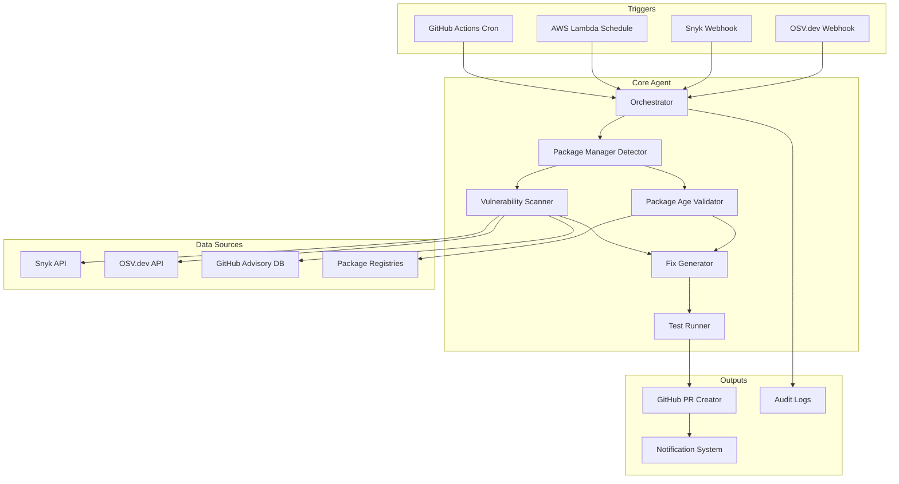

# Security Agent Architecture

## Overview

The Security Agent is an AI-powered system designed to mitigate supply chain attacks by monitoring, analyzing, and automatically fixing package vulnerabilities across multiple programming languages.

## System Architecture



## Core Components

### 1. Orchestrator

**Purpose**: Main coordination layer that manages the workflow

**Responsibilities**:

- Receive triggers from various sources
- Coordinate component execution
- Handle errors and retries
- Manage configuration loading
- Generate audit reports

### 2. Package Manager Detector

**Purpose**: Identify project type and package management system

**Supported Ecosystems**:

- JavaScript/TypeScript: `package.json`, `package-lock.json`, `yarn.lock`, `pnpm-lock.yaml`
- Python: `requirements.txt`, `Pipfile`, `poetry.lock`, `pyproject.toml`
- Go: `go.mod`, `go.sum`
- Java: `pom.xml`, `build.gradle`, `build.gradle.kts`

**Output**: Normalized package list with versions

### 3. Vulnerability Scanner

**Purpose**: Check packages against multiple vulnerability databases

**Data Sources**:

- Snyk Vulnerability Database
- OSV.dev (Open Source Vulnerabilities)
- GitHub Advisory Database
- National Vulnerability Database (NVD)

**Features**:

- Parallel scanning across sources
- Severity scoring aggregation
- False positive filtering
- CVE correlation

### 4. Package Age Validator

**Purpose**: Ensure packages meet minimum age requirements

**Configuration**:

```typescript
{
  minPackageAge: {
    default: 14, // days
    critical: 30, // for production dependencies
    dev: 7       // for dev dependencies
  }
}
```

**Checks**:

- Package publish date from registry
- Version release date
- Maintainer reputation score
- Download statistics trends

### 5. Fix Generator

**Purpose**: Generate fixes for identified vulnerabilities

**Strategies**:

#### Rule-Based Fixes

- Version bumping to safe versions
- Dependency replacement
- Configuration updates
- Lock file regeneration

#### LLM-Powered Fixes

- Code refactoring for breaking changes
- API migration assistance
- Complex dependency resolution
- Custom patch generation

**Pluggable Architecture**:

```typescript
interface FixStrategy {
  canHandle(vulnerability: Vulnerability): boolean;
  generateFix(context: FixContext): Promise<Fix>;
  estimateCost(): number;
}
```

### 6. Test Runner

**Purpose**: Validate fixes before creating PRs

**Test Types**:

- Unit tests
- Integration tests
- Build verification
- Smoke tests

**Features**:

- Parallel test execution
- Timeout management
- Coverage reporting
- Failure analysis

### 7. GitHub Integration

**Purpose**: Create and manage pull requests

**Features**:

- Automated PR creation
- Detailed descriptions with CVE links
- Test results in PR comments
- Status checks integration
- Auto-labeling (security, dependencies)
- Changelog generation

## Deployment Options

### GitHub Actions

```yaml
name: Security Agent
on:
  schedule:
    - cron: "0 2 * * *" # Daily at 2 AM
  workflow_dispatch:
  repository_dispatch:
    types: [vulnerability-alert]
```

**Benefits**:

- Native GitHub integration
- No external infrastructure
- Free for public repos
- Easy secrets management

### AWS Lambda

**Configuration**:

- Runtime: Node.js 20.x
- Memory: 1024 MB
- Timeout: 15 minutes
- Triggers: EventBridge Schedule, API Gateway

**Benefits**:

- Serverless scaling
- Cost-effective for multiple repos
- Webhook support
- CloudWatch integration

## Configuration System

### Project-Level Config

```yaml
# .security-agent.yml
version: 1

packageAge:
  default: 14
  critical: 30
  dev: 7

vulnerabilitySources:
  - snyk
  - osv
  - github

fixStrategy:
  mode: hybrid # rule-based, llm, hybrid
  llmProvider: anthropic
  autoMerge: false

testing:
  required: true
  commands:
    - npm test
    - npm run build

notifications:
  slack: true
  email: true

excludePackages:
  - legacy-package-name

severityThreshold: medium # low, medium, high, critical
```

### Global Config

Environment variables and secrets:

- `GITHUB_TOKEN`: GitHub API access
- `SNYK_TOKEN`: Snyk API access
- `ANTHROPIC_API_KEY`: LLM access (optional)
- `SLACK_WEBHOOK`: Notifications (optional)

## Data Flow

### Scheduled Scan Flow

1. Trigger fires (cron/schedule)
2. Orchestrator loads configuration
3. Clone/checkout repository
4. Detect package managers
5. Extract package lists
6. Validate package ages
7. Scan for vulnerabilities
8. Generate fixes for issues
9. Apply fixes to branch
10. Run tests
11. Create PR if tests pass
12. Send notifications
13. Generate audit log

### Webhook Trigger Flow

1. Receive webhook (Snyk/OSV)
2. Parse vulnerability data
3. Identify affected repositories
4. For each repository:
   - Check if package is used
   - Generate targeted fix
   - Run tests
   - Create PR
5. Send notifications

## Security Considerations

### Secrets Management

- Use GitHub Secrets for Actions
- Use AWS Secrets Manager for Lambda
- Never log sensitive data
- Rotate tokens regularly

### Code Execution Safety

- Sandbox test execution
- Timeout limits
- Resource constraints
- Dependency isolation

### Supply Chain Protection

- Verify package signatures
- Check maintainer reputation
- Monitor download patterns
- Detect typosquatting

## Monitoring & Observability

### Metrics

- Vulnerabilities detected
- Fixes applied
- Test success rate
- PR merge rate
- Scan duration
- API rate limits

### Logging

- Structured JSON logs
- Correlation IDs
- Error tracking
- Audit trail

### Alerting

- Failed scans
- Test failures
- API errors
- Rate limit warnings

## Extensibility

### Adding New Package Managers

```typescript
interface PackageManager {
  detect(repoPath: string): boolean;
  extractPackages(repoPath: string): Promise<Package[]>;
  updatePackage(pkg: Package, version: string): Promise<void>;
  runTests(repoPath: string): Promise<TestResult>;
}
```

### Adding New Vulnerability Sources

```typescript
interface VulnerabilitySource {
  name: string;
  scan(packages: Package[]): Promise<Vulnerability[]>;
  getDetails(cveId: string): Promise<VulnerabilityDetails>;
}
```

### Adding New Fix Strategies

```typescript
class CustomFixStrategy implements FixStrategy {
  canHandle(vuln: Vulnerability): boolean {
    // Custom logic
  }

  async generateFix(context: FixContext): Promise<Fix> {
    // Custom fix generation
  }
}
```

## Performance Optimization

### Caching

- Package metadata cache (24h TTL)
- Vulnerability database cache (6h TTL)
- Registry API responses (1h TTL)

### Parallelization

- Concurrent vulnerability scans
- Parallel test execution
- Batch API requests

### Rate Limiting

- Respect API rate limits
- Exponential backoff
- Request queuing

## Future Enhancements

1. **Machine Learning**
   - Vulnerability prediction
   - False positive reduction
   - Fix success probability

2. **Additional Languages**
   - Rust (Cargo)
   - Ruby (Bundler)
   - PHP (Composer)
   - .NET (NuGet)

3. **Advanced Features**
   - Dependency graph analysis
   - License compliance checking
   - Performance regression detection
   - Cost impact analysis

4. **Integration Expansion**
   - GitLab support
   - Bitbucket support
   - Azure DevOps support
   - Jira integration
